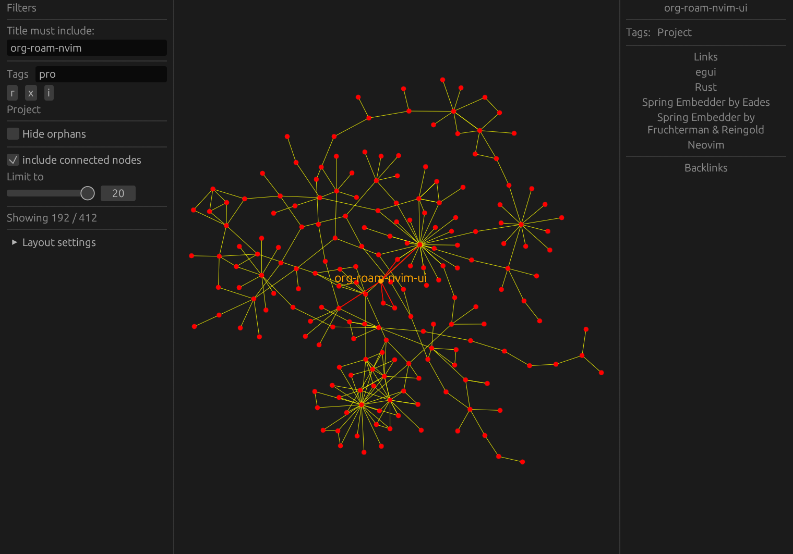

# org-roam-nvim-ui

A GUI viewer for [org-roam.nvim](https://github.com/chipsenkbeil/org-roam.nvim).

> WARNING: This project is mainly a playground for experimenting with some immediate UI patterns.
> There are no concrete plans for any future development.



## Running

Running directly from the repo

```bash
cargo run --release
```

Installable to `~/.cargo/bin` with

```bash
cargo install --path .
```

> Note: The GUI parses the cache file written by `org-roam.nvim` directly once on startup.
> The database can be re-written with `:RoamSave`.
> Re-start the GUI afterwards to reload it.

## Keybinds

- `<ctrl>-q` to quit
- Left click and drag to pan
- Scroll wheel to zoom
- Mouse side buttons to jump in selection history

## Neovim

### Setup

Plugin spec for [lazy.nvim](https://github.com/folke/lazy.nvim):

```lua
{
    'bi0ha2ard/org-roam-nvim-ui',
    dependencies = {
      "chipsenkbeil/org-roam.nvim",
    },
    ft = "orgmode",
    -- Path to the executable can be provided explicitly here.
    -- opts = {
    --   executable = "org-roam-nvim-ui"
    -- },
    -- Compiles the GUI locally
    build = function ()
      require('org-roam-ui').compile()
    end
}
```

### Usage

To focus the current file's node in the UI:

```
:lua require('org-roam-ui').open()
```

Or with the following keymap:

```
vim.keymap.set('n', '<leader>ru', function()
  require('org-roam-ui').open()
end, { buffer = 0, desc = 'open in org roam ui' })
```
